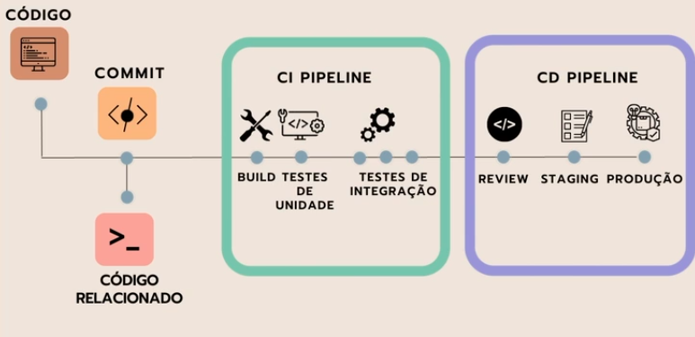

# CURSO NODE.JS - ALURA

# <p id="sumario">Sumário</p>

PARTE 1: <a href="#fluxo-desenvolvimento-integracao" style="font-weight: bold">Melhorando o Fluxo de Desenvolvimento e Integração da Equipe</a>

1.1 <a href="#fluxo-trabalho">O Fluxo de Trabalho</a>

- <a href="#padronizacao-projetos">Padronização de Projetos</a>
- <a href="#comandos-docker">Comandas Docker</a>

1.2 <a href="#trabalhando-feat">Trabalhando em uma Feat</a>

- <a href="#github-actions">Github Actions</a>
- <a href="#add-test">Adicionando Testes</a>

1.3 <a href="#Workflows-projeto">Workflows de Projeto</a>

- <a href="#trabalhando-branchs">Trabalhando com Branches</a>

---

# <p id="fluxo-desenvolvimento-integracao">Melhorando o Fluxo de Desenvolvimento e Integração da Equipe</p>

## <p id="fluxo-trabalho">O Fluxo de Trabalho</p>

### <p id="padronizacao-projetos">Padronização de Projetos</p>

| **ESQUEMA CI/CD - INTEGRAÇÃO CONTINUA** |
|-----------------------------------------|



**Pipeline de Integração Contínua (CI)**:
1. Build.
2. Testes de Unidade.
3. Testes de Integração.

**Pipeline de Entrega Contínua (CD)**:
1. Review do Código.
2. Staging.
3. Produção.

_Nota: flag --fix buscar resolver todos os problemas de código._
- `"lint": "eslint --fix --ignore-path .gitignore ."`

### <p id="comandos-docker">Comandas Docker</p>

```bash
# FAZ BUILD E SOBE SERVIÇO ESCOLHIDO NO DOCKER-COMPOSE
sudo docker-compose up <service>

# DERRUBA O SERVIÇO ESCOLHIDO NO DOCKER-COMPOSE
sudo docker-compose down <service>

# REALIZA BUILD SEM SUBIR O SERVIÇO
# - utilizado para forçar atualização de serviço
sudo docker-compose build

# LISTA DE CONTAINERS EM EXECUÇÃO
sudo docker ps

# LISTA TODOS OS VOLUMES
# - volumes são utilizados quando se há necessidade de armazenar dados
sudo docker volume ls

# REMOVE VOLUME
sudo docker volume rm <id>

# REMOVE TODOS OS CONTAINERS
docker rm -f $(docker ps -a -q)

# ABRE TERMINAL DO CONTAINER
sudo docker exec -it <id do container> sh
```

## <p id="trabalhando-feat">Trabalhando em uma Feat</p>

### <p id="github-actions">Github Actions</p>

```yml
# VERIFICAÇÕES DE CI

name: pre-push
# DISPAROS PARA INICIAR AS ACTIONS
on:
  push:
  # BRANCH QUE SERÁ IGNORADA NA ACTION
    branches-ignore:
      - main
jobs:
  test:
    name: Linter
    runs-on: ubuntu-latest
    steps:
      - uses: actions/checkout@v3
      - uses: actions/setup-node@v3
        with:
          node-version: 18
      - name: Instala as dependencias
        run: npm i
      - name: Roda o linter
        run: npm run lint


name: testes-unitarios
on:
  pull_request:
  # INFORMA QUANDO IRÁ OCORRER A ACTION
  # - opened: abertura do pull request
  # - synchronize: quando o serviço é sincronizado
    types: [ opened, synchronize ]
    # INFORMA A BRANCH QUE DEVE OCORRER A ACTION
    branches:
      - main
jobs:
  test:
    name: Test
    runs-on: ubuntu-latest
    steps:
      - uses: actions/checkout@v3
      - uses: actions/setup-node@v3
        with:
          node-version: 18
      - name: Instala as dependencias
        run: npm i
      - name: Roda os testes
        run: npm test

```

### <p id="#add-test">Adicionando Testes</p>

```javascript
/**
 * Teste para verificar se a API retorna corretamente uma lista de livros de um autor específico.
 */
it('Deve retornar uma lista de livros', (done) => {
  // Define o ID do autor que será usado na requisição
  const autorId = 1;

  // Inicia uma requisição HTTP GET para o endpoint que retorna os livros de um autor
  chai.request(app)
    .get(`/autores/${autorId}/livros`) // Endpoint da API para buscar livros de um autor específico
    .set('Accept', 'application/json') // Define o cabeçalho para aceitar respostas em JSON
    .end((err, res) => { // Callback executado quando a resposta chega
      // Verifica se o status HTTP da resposta é 200 (OK)
      expect(res.status).to.equal(200);

      // Verifica se o corpo da resposta possui a propriedade 'autor'
      expect(res.body).to.have.property('autor');

      // Verifica se o corpo da resposta possui a propriedade 'livros'
      expect(res.body).to.have.property('livros');

      // Verifica se a propriedade 'livros' é um array
      expect(res.body.livros).to.be.an('array');

      // Indica que o teste terminou
      done();
    });
});
```

### Extra: Camadas de Segurança no Repositório

| **Etapas de Configuração** |
|----------------------------|

```bash
-| <repositorio_projeto>
 |--| settings
    |--| Branches
```

## <p id="Workflows-projeto">Workflows de Projeto</p>

### <p id="trabalhando-branchs">Trabalhando com Branches</p>

**FEATURE BRANCHING** - ramo é criado para focar uma única feature.

<a href="#sumario">Retornar ao sumário</a>